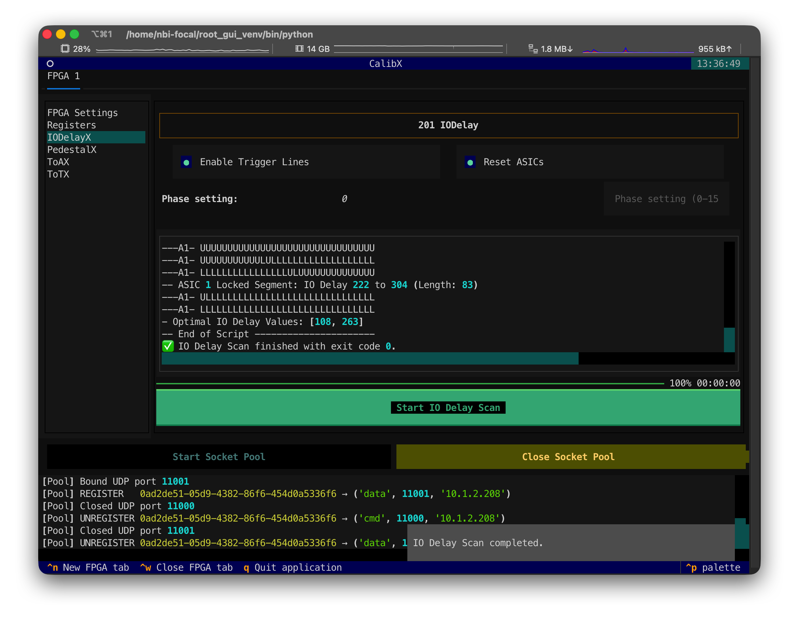
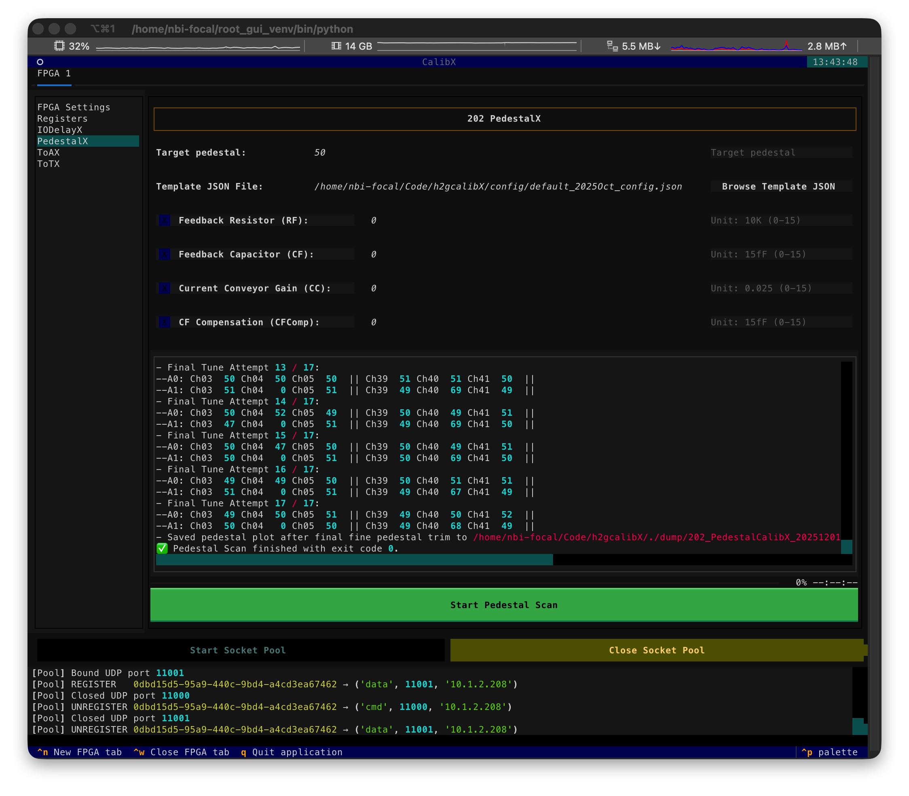
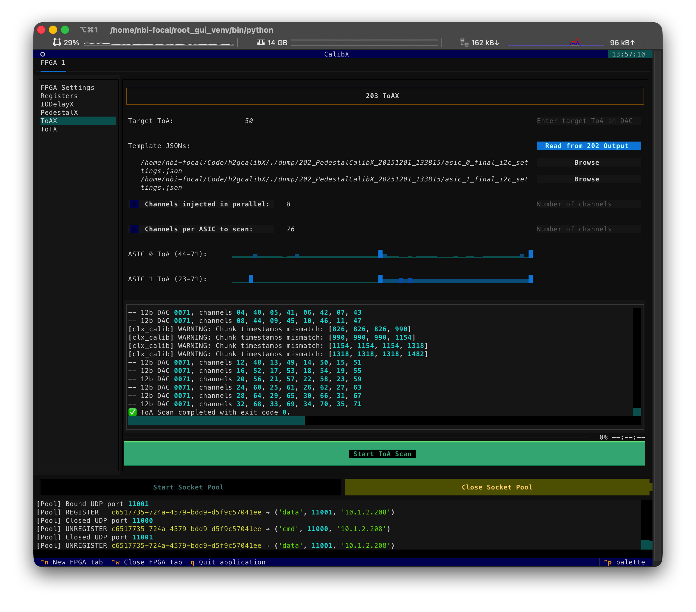

# CalibX for H2GCROC - KCU System
[](https://home.cern/science/experiments/alice)  [](https://nbi.ku.dk/english/)

## Quick Start

1. Start with the TUI interface:

   ```bash
   python3 ./200_UI.py
   ```

2. If it is your first time running the calibration, you have to create a new FPGA tab with shortcut `Ctrl+N` or click it from the bottom bar.


3. Choose the FPGA UDP setting json file, and make sure the `ASIC Number` is set correctly.


4. Click the `Start Socket Pool` button to set up the UDP communication.

5. Now you can run the IODelay settings for the FPGA to correctly receive data from the H2GCROC.


6. For the pedestal calibration, go to the `PedestalX` tab, set the target pedestal value in ADC, and choose the template register json file. This will take around 5 minutes for a 2-ASIC setup. And the results will be saved in the `dump/` folder.


7. Next step is usually the ToA scan in the `ToAX` tab. Again, set the target ToA value in injection DAC, and choose the tamplate register json file. Is is recommended to use the `Read from 202 output` button to load the pedestal calibration results. This will take around 15 minutes if you inject 8 channels in parallel for a 2-ASIC setup. The results will also be saved in the `dump/` folder.
