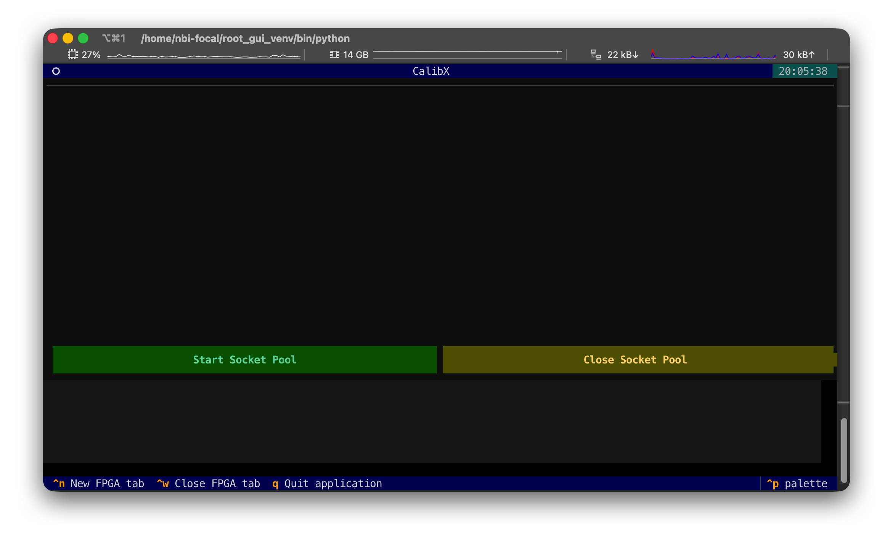
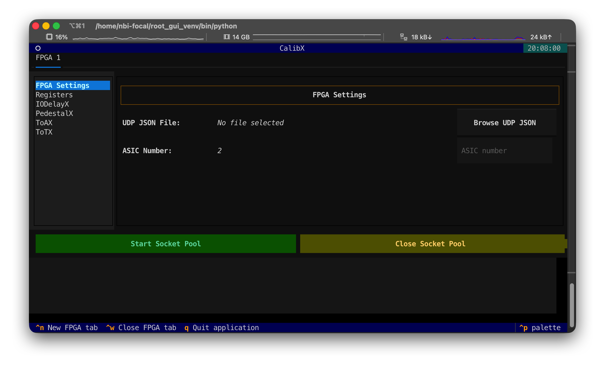

# CalibX for H2GCROC - KCU System
[](https://home.cern/science/experiments/alice)  [](https://nbi.ku.dk/english/)

## Quick Start

1. Start with the TUI interface:

   ```bash
   python3 ./200_UI.py
   ```

2. If it is your first time running the calibration, you have to create a new FPGA tab with shortcut `Ctrl+N` or click it from the bottom bar.


3. Choose the FPGA UDP setting json file, and make sure the `ASIC Number` is set correctly.

